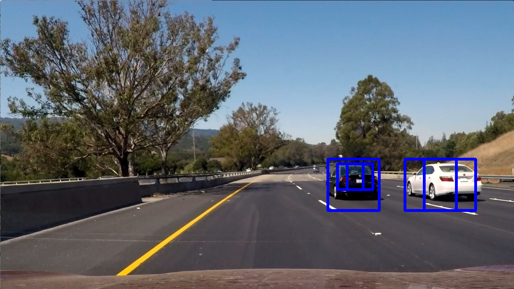
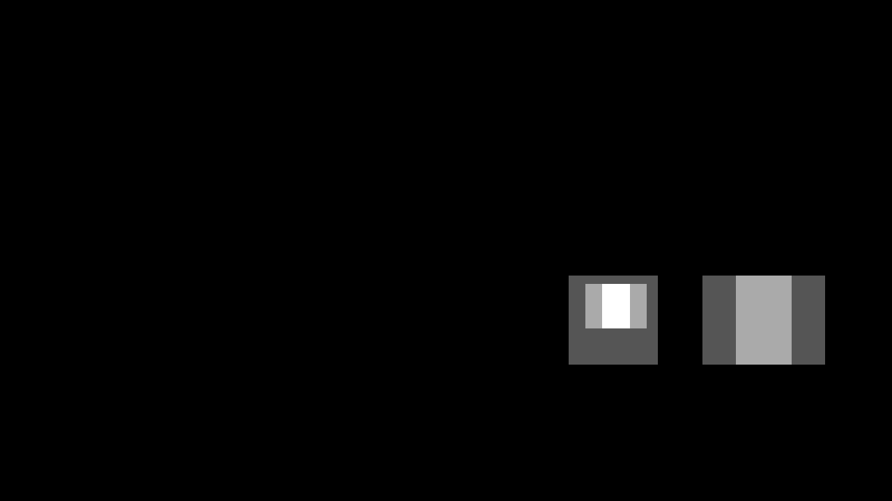
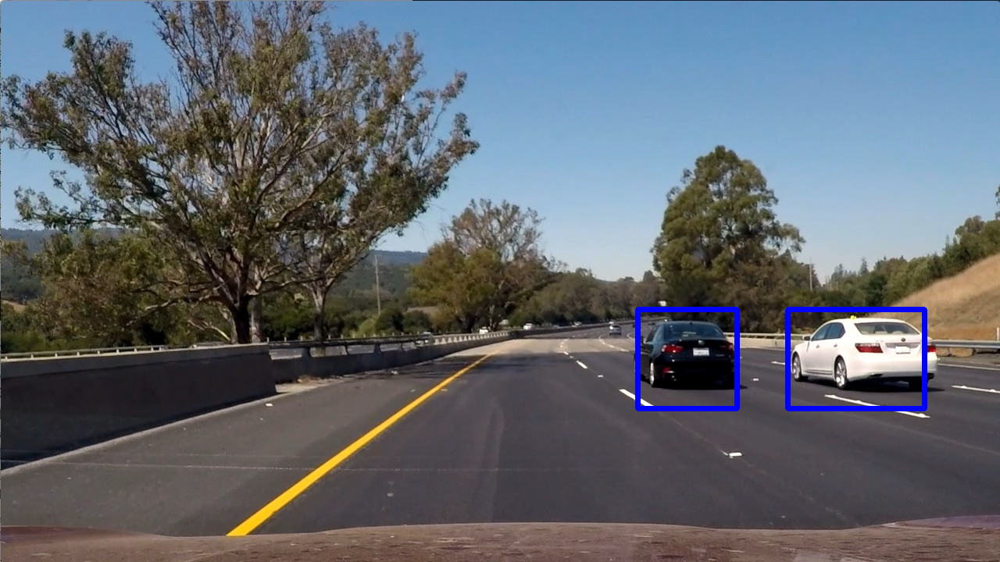

## Overview

This repository contains a Python program to detect vehicles on the road.

All the code is in vehicle_detection.py
The sample results are in output_files.

## Dependencies

* Python 3.5
* NumPy
* OpenCV
* Matplotlib
* MoviePy
* Sklearn
* Scipy

## Running the code

### Demo Run

Run:

```
wget https://s3.amazonaws.com/udacity-sdc/Vehicle_Tracking/vehicles.zip
wget https://s3.amazonaws.com/udacity-sdc/Vehicle_Tracking/non-vehicles.zip
python vehicle_detection.py
```

## Writeup / Reflection

#### 1. Provide a Writeup / README that includes all the rubric points and how you addressed each one. 

You're reading it!

#### 2. Extraction of HOG features from training images, and parameter selection
single_img_features() in line 186 is the main function that extracts features for training. It calls get_hog_features( a wrapper for skimage.feature.hog). I use orient=9, pix_per_cell=8, cell_per_block=2, spatial_size=(32,32), hist_bins=32 in the YCrCb color space. The choice of these parameters was meant to provide expresive features without incrementing the computational load by a lot. Finer features can be better learned but take a computational toll.

#### 3. Classifier training
train() in line 307 is the main function that trains a SVM for classification, and cross validates its performance. StandardScaler() and scaling around 128.0 was performed for numerical optimization.  The cross validation performance was 0.99 with the following parameters:

```
SVC Param: {'class_weight': None, 'cache_size': 200, 'coef0': 0.0, 'C': 1.0, 'random_state': None, 'tol': 0.001, 'probability': False, 'shrinking': True, 'verbose': False, 'degree': 3, 'kernel': 'rbf', 'decision_function_shape': None, 'max_iter': -1, 'gamma': 'auto'}
```

#### 4. Sliding window search
The find_cars method in line 82 performs an sliding window search based on an image region and scale. The find_all_cars method calls the find_cars functions with the followong combination of regions and scales:
```
        box_list = find_cars(img, box_list, y_size*0.5, y_size*0.7, 1, self.svc, self.scaler)
        box_list = find_cars(img, box_list, y_size*0.55, y_size*0.8, 2, self.svc, self.scaler)
        box_list = find_cars(img, box_list, y_size*0.7, y_size, 3, self.svc, self.scaler)
```
Those combinations were chosen to account for the fact that cars will occupy less pixels at a distance, but more when they are close to you. Then, the images are then scaled such that vehicles could be enclosed in 64x64 image patches, as the vehicle images I used for training.

#### 5. Pipeling overview
The SVC gives raw predictions:

From all the raw predictions, a heatmap is generated 

Thresholding the heatmaps, we obtain the final predicition:



#### 6. Video Result

Here's a [link to my video result](./output_files/project_video.mp4)

#### 7.  False Positives

The main logic to reject false positives is implemented within the process_image(). A memory of the predicitions is kept (self.box_list_memory). Heatmaps are formed using the predicitions from both the present and recent past. Because outliers rarely appear in consecutive frames, this heatmap framework filters out outliers.

#### 8. Problems and potential improvements
	* The pipeline is not to real-time  